# Big Data Hadoop and Spark Developer

Tradicionalmente nos basabamos en la intuición para la toma de decisiones, a día de hoy el Big Data nos permite tomar una visión comprensiva de nuestros datos sin importar que tan grande sea la organización.

### Big Data Analytics Pipeline
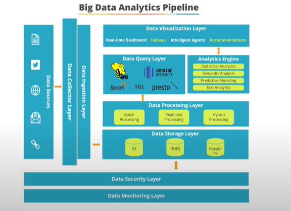

### Data types
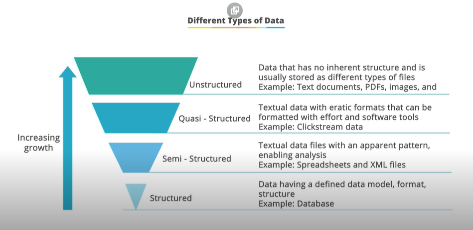

## 4 Vs del Big Data

• **Volumen:** Grandes cantidades datos

• **Variety:** Social, CRM, emails, audio, etc

• **Velocity:** Velocidad con la que los nuevos datos son generados

• **Veracity:** Datos incorrectos producen predicciones incorrectas

### Traditional RDBMS and DWH
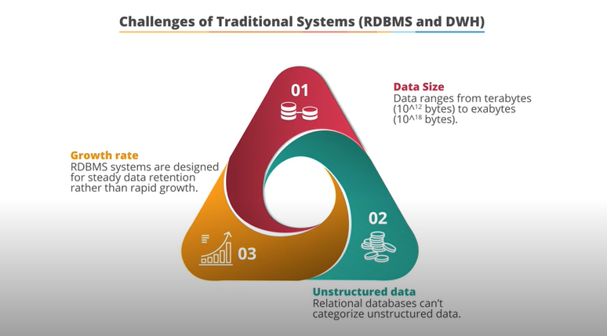

### Advantages of big data
1. Procesar todos los tipos de datos a gran escala
2. Procesar grandes cantidades de datos en tiempo real
3. Puede correr en cualquier lugar, el hardware puede ser añadido sin inconvenientes
4. Mejor toma de decisiones gracias a integrar la información

El Big Data está basado en sistemas distribuidos (ordenadores conectados sobre una red), estos tienen inconveniente que actualmente son sokventados con Hadoop para poder distribuir la carga y el procesamiento.

## Hadoop

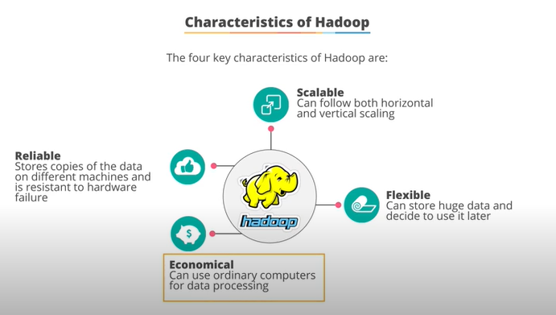
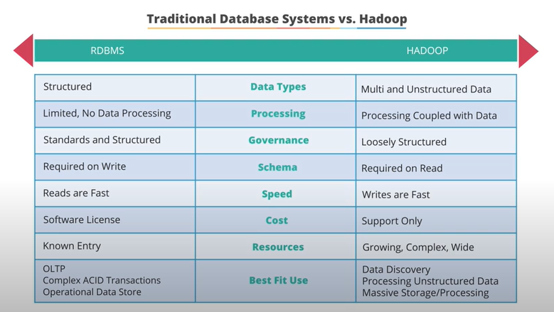
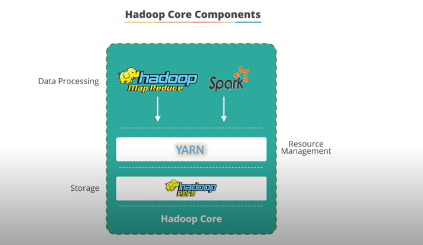
____
**Components of Hadoop Ecosystem HDFS(Hadoop Distributed File System)** 
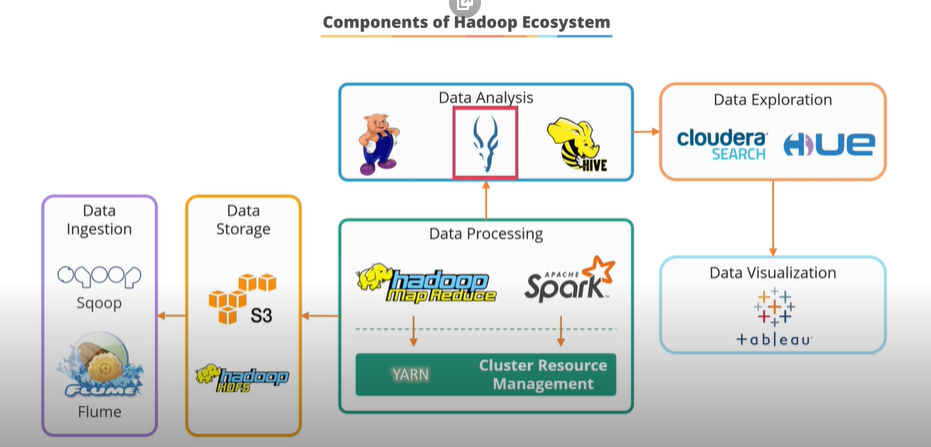

• Store Data
1. Hadoop HDFS: Storage layer, distributed storage and processing, streaming access to file system data, provides file permissions and authentication
2. HBase: Stores data in HDFS, it is No-SQL, it is used when we need random, real-time, read/write access to our Big Data, supports high volumens.
   
• Ingesting Data

1. Sqoop: It enables to transfer data between SQL databases and HDFS. 
2. Flume: Ingesting data from streaming (IoT)
   
• Data processing
1. Spark: Open source cluster computing framework, Provides 100 times faster performance than Map-Reduce, it includes libs for BI, ML and Streaming data.
   
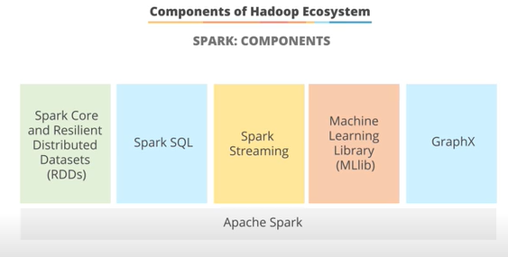
2. Hadoop Map-Reduce: The original Hadoop processing engine (based in Java), based in map and reduce concepts.

• Data Analysis
1. Pig: It can convert pig script into map reduce script, best for ad-hoc queries such as join and filter.
2. Impala: High performance SQL engine wich runs on Hadoop cluster. Ideal for interactive analysisi. Very low latency.
3. Hive: Extraction layer, best for data procesing and ETL, excutes queries using Map-Reduce.

• Data Search and use
1. Cloudera Search: Real-time access to products, enables nontechnical users to search and explore data stored in or ingested into Hadoop and Hbase. Fully integrated data processing, ideal for bussines tasks.

• Others
1. Oozie: Workflow or coordination system for hadoop jobs.
2. HUE: Haddop User Experience: GUI for Hadoop. SQL, Impala, MySQL, Oracle, PostgreSQL, SPARK SQL and Slor SQL.

#### COmercial Hadoop Distributions

1. Cloudera
2. Hortonworks
3. MAPR
4. Amazon EMR
5. Azure HDinsight

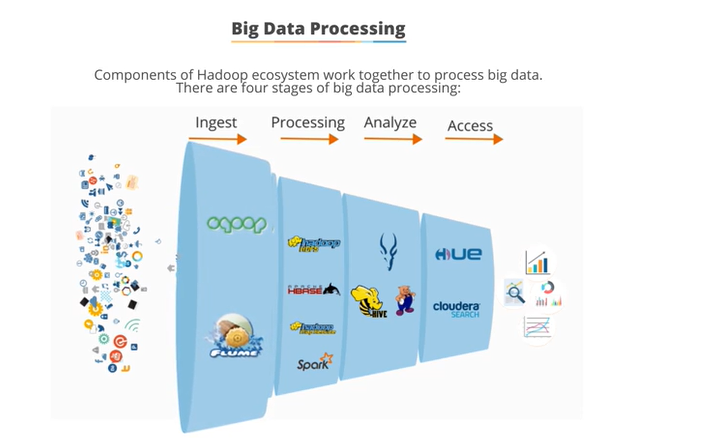

____

## HDFS and Yarn

HDFS: Hadoop distributed file system, provides access to data across Hadoop clusters. It resolves the three problems: Cost, Speed (read or write more than 1 terabyte of data in a second) and Reliability(it has copies)

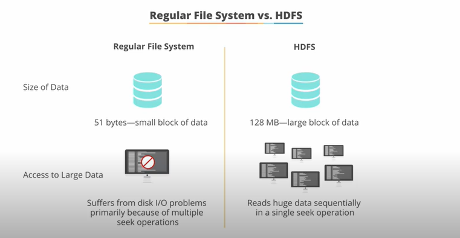

Data is divided in 128 mb of data.

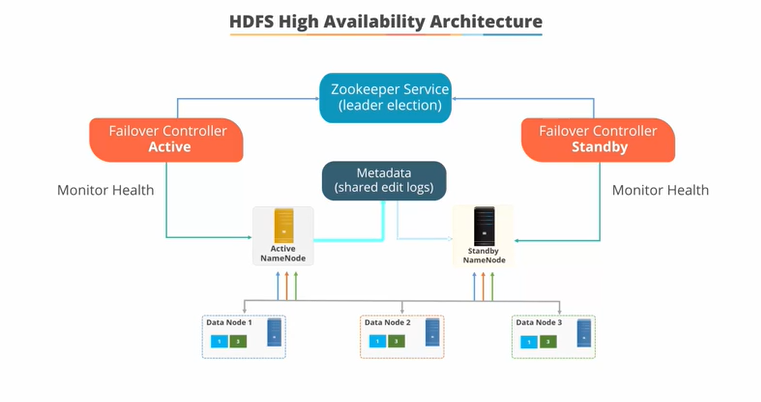

