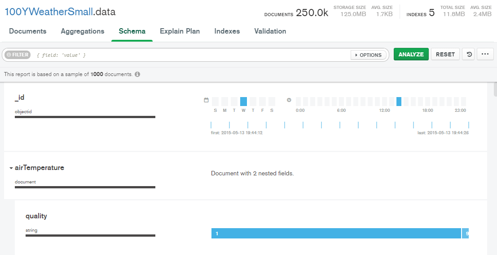
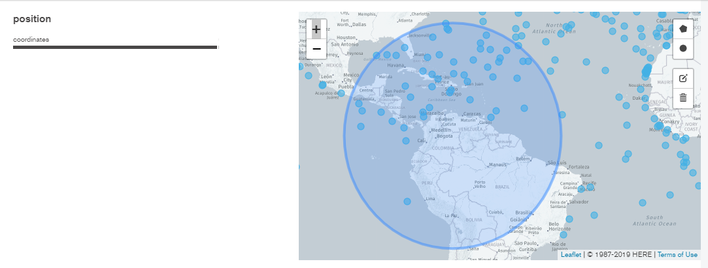

# MongoDB
Apuntes curso Mongo DB

**¿Qué es Mongo?**

Es un SGBD NoSQL (no usa el modelo relacional). Orientado a documentos, almacena en  formato JSON,
podemos hacer consultas con lenguajes como JS (nativa) y python.
Los docuemntos se agrupan en colecciones, se tienen esquemas dinámicos, se tiene acceso rápido a la información.

Ranking de bases de datos: https://db-engines.com/en/ranking

Testear el puerto libre para mongo db: 
http://portquiz.net:27017

Usar base de datos remot Atlas para práctica
Nos conectamos desde mongo compass a la siguiente dirección

Hostname: cluster0-shard-00-00-jxeqq.mongodb.net

Authentication: Username / Password

Username: m001-student

Password: m001-mongodb-basics

Replica Set Name: Cluster0-shard-0
Read Preference: Primary Preferred

## Conceptos NoSQL

Base de datos -> Agrupa colecciones usadas para una aplicación
Colección -> Agrupa documentos similares
Documento -> Guarda los JSONs

Espacio Nombres: para referirinos NOMBREBASEDATOS.NOMBRECOLECCIÓN, ejemplo: Empresa.Usuarios

Cada documento se identifica por su _id

### Usando Mongo Compass

Permite visualizar las bases de datos, sus datos operaciones CRUD de los objetos. Schema permite analizar y presentar un pequeño resumen de los datos. No olvidar que el schema es solo tomado a partir de una muestra. Este schema me permite hacer una análisis rápido de los datos, puedo usar los filtros en formato {clave: valor}

____

### Tipos de datos

1. Cadena de caracteres (string)
2. Enteros (int32)
3. Decimales (double)
4. Fechas (dates)
5. Documentos (object document)
6. Vectores (array)
7. Sistemas de coordenadas espaciales.

Ejemplo de visualización en Schema

Ejemplo de visualización de datos espaciales

<code>
position:Object

type:"Point"

coordinates:Array

0:-30.1

1:35.5
</code>

## Búsquedas con filtros

#### Filtros igualdad

*Ejemplo:* Con la base de citibike se puede hacer búsqueda,

<code>
{'end station name': 'W 21 St & 6 Ave'}
</code>

#### Filtros rango

*Ejemplo:* Con la base de citibike se puede hacer búsqueda,

Se tienen los operadores:

  - $gt greater than                            (mayor que)

  - $gte greater than or equal to        (mayor o igual que)

  - $lt  less than                                 (menor que)

  - $lte less than or equal to             (menor o igual que)

<code>
{'birth year': {$gte: 1985,$lt: 1992}}

// con dos parámetros:

{'birth year': {$gte: 1985,$lt: 1992},bikeid: {$gte: 19500,$lt: 22000}}
</code>

#### JSON

Java Script Object Notation

Fácil lectura y edición para humanos y ordenadores, rápido acceso, basado en clave valor

